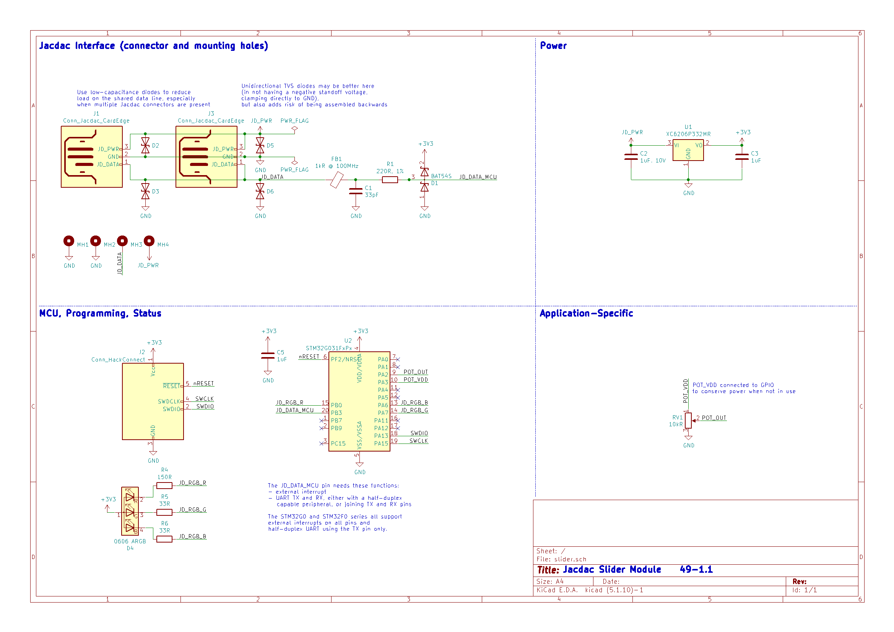
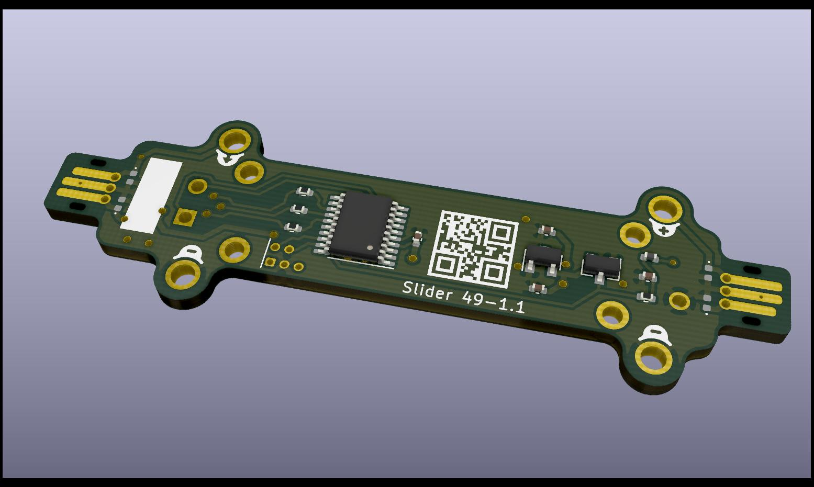

# Example Slider Module for Jacdac, in KiCad

| Schematic | Board |
| --- | --- |
|  | Front side    |
|  | Back side    |

This is an example / reference Jacdac module built in [KiCad](https://www.kicad.org/), an open-source PCB design suite.

## Structure overview

This KiCad project uses local (per-project, relative path) references to the Jacdac symbol and footprint libraries that are included in this repository.
This also includes a project-specific `slider.pretty` footprint library containing the module QR code, as generated by the [Jacdac Silk QR Code generator](https://microsoft.github.io/jacdac-docs/tools/qr-silk/), and consistent with its entry in the [device map CSV](https://github.com/microsoft/jacdac/blob/main/devices/microsoft/research/qr-url-device-map.csv).

Fabrication data (gerbers, pick-and-place) is included in the `fab-1.1` folder.

## Fabrication notes for JLC

We fabricated our prototype run for this board with JLCPCB, which offers low-volume board fabrication and single-sided assembly services.
Below are notes for how we generated fabrication data.

### Gerbers
Gerbers can be generated with the typical KiCad flow.

### Part numbers
In the schematic, we added a `LCSC` field to all components, containing the JLCPCB part numbers.
To generate the pick-and-place parts: in the schematic editor, go to Tools menu > Generate Bill of Materials..., run bom2grouped_csv, which produces a `slider.csv` in the project directory.
This should have a LCSC column with the JLC part numbers.

Rename columns as follows:
- `Reference` -> `Designators`
- `LCSC` -> `LCSC Part #`
- `Value` -> `Comment`
- Other columns can be left as-is

### Positions
In the layout editor, go to File menu > Fabrication Outputs > Footprint Position (.pos) File...
Since JLC does one layer only, select "Separate files for front and back".
This creates a `slider-bottom-pos.csv` (and top file that can be discarded) in the output directory.

Rename columns as follows:
- `Ref` -> `Designator`
- `PosX` -> `Mid X`
- `PosY` -> `Mid Y`
- `Side` -> `Layer`
- Other columns can be left as-is

Optionally, correct rotations on parts.
While we've sent in fabrication data with obviously wrong rotations (eg, TSSOP-20 oriented 90 degree off) and didn't get obviously wrong PCBs back, you can correct the rotations using a spreadsheet tool like Excel:
- Rename `Rot` to something different, eg `KiCadRot`.
- Add a `RotCorrection` column or something, to be manually set for each part. Positive rotation is clockwise (unmirrored view, at least on the bottom layer).
- Add a `Rotation` column, set to the formula of the KiCadRot cell plus the RotCorrection cell. **This is the column containing the actual fabrication data.**

### Ordering Notes
In the PCB options, choose:
- Upload gerbers
- PCB Qty: as desired
- Surface Finish: ENIG-RoHS
- Gold Fingers: Yes
- 45 finger chamfered: No (ideally yes, but the board is too small)
- The defaults for the rest are fine

In the SMT Assembly options, choose:
- Assembly bottom side (the side with the QR code)
- Tooling holes: Added by JLCPCB
- Click "confirm"
- Add BOM File -> upload the `slider.csv` file (schematic BoM)
- Add CPL file -> upload the `slider-bottom-pos.csv` file (layout footprint position)
- Click "next"
- Review the component table
- Click "next"
- Review the placed preview, and fix footprint data as necessary (red dot indicates pin 1?)
  - If you need to go back, there is a not-at-all-obvious grey "< Go back" link at the bottom left of the page
- Review unselected parts: these are parts that will not be placed and should only be top-layer or other items to be manually soldered, card edge connectors, and mounting holes
- Click "save to cart"

Stencils:
- From the shopping cart, "Add new item"
- At the top, select the SMT-Stencil tab
- Upload gerbers, same as the PCB
- Stencil Side: Top & Bottom(On Separate Stencil)
- Stencil Qty: 2 (default)
- Fiducials: Etched Through
- Click "save to cart"
